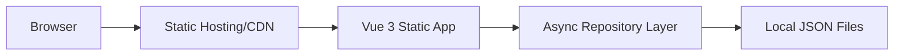
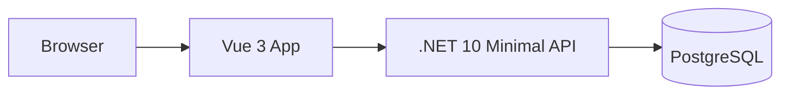
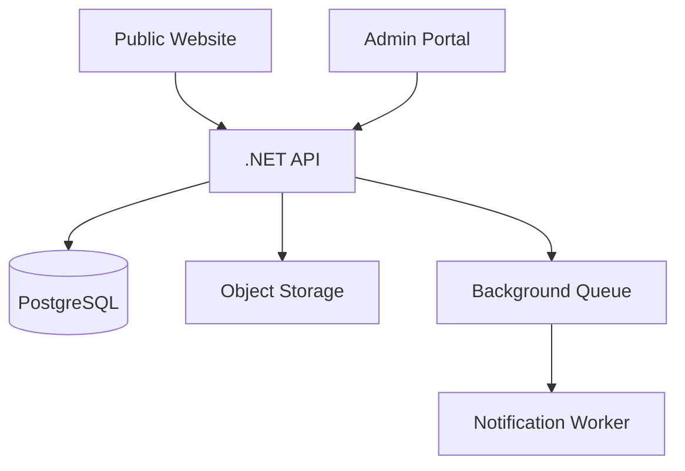
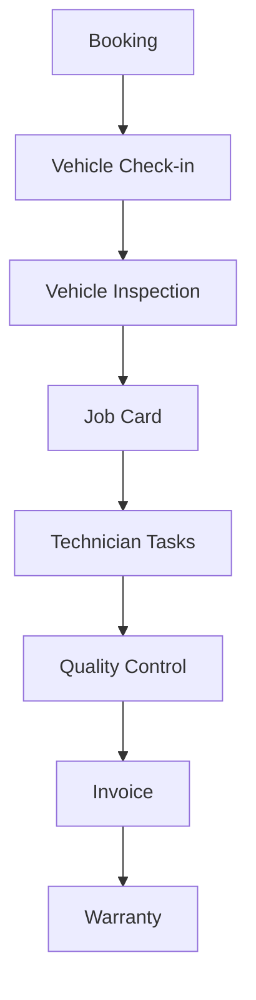
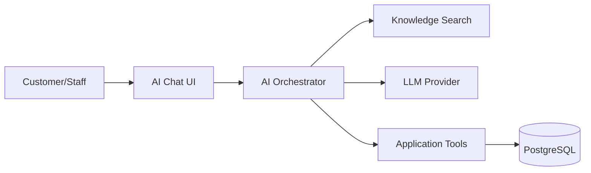

# Architecture

## Principle
Start simple, but keep boundaries clean enough to scale.

Use **static frontend-first architecture** in Phase 1, then evolve into a **modular monolith** backend from Phase 2 onward. Do not start with microservices.

## Phase 1 — Static Public Website


### Communication
```text
Vue Component -> Repository Function -> Local JSON
```

Example:
```ts
const products = await productRepository.getProducts();
```

## Phase 2 — Public API + Database


### Communication
```text
Vue Component -> Repository Function -> HTTP API -> .NET API -> PostgreSQL
```

The Vue component code should not change when switching from JSON to API.

## Phase 3 — CMS + Lead + Booking


Modules:
- Catalog
- CMS
- Branches
- Customers
- Vehicles
- Leads
- Bookings
- Quotations
- Notifications
- Audit Logs

## Phase 4 — Garage Operations


Modules:
- Job Cards
- Job Card Tasks
- Vehicle Inspection Images
- Inventory
- Warranty
- Invoice
- Payments

## Phase 5 — AI Architecture


AI Orchestrator responsibilities:
- Prompt templates
- Retrieval
- Tool calling
- Guardrails
- Logging
- Feature flags
- Cost tracking
- Rate limiting
- Human review flags

## Backend Modular Monolith Structure
```text
src/
  Garage.Api/
  Garage.Application/
    Catalog/
    CMS/
    Branches/
    Customers/
    Vehicles/
    Leads/
    Bookings/
    Quotations/
    JobCards/
    Inventory/
    Warranty/
    AI/
    Notifications/
  Garage.Domain/
  Garage.Infrastructure/
  Garage.Worker/
tests/
  Garage.UnitTests/
  Garage.IntegrationTests/
```

## Deployment Target
Phase 1:
- Azure Static Web Apps
- Cloudflare Pages
- Netlify
- Vercel

Phase 2+:
- Azure Container Apps for .NET API
- PostgreSQL flexible server or Azure SQL
- Azure Blob Storage
- Azure Key Vault
- Azure Application Insights
- Azure AI Search
- Azure OpenAI
