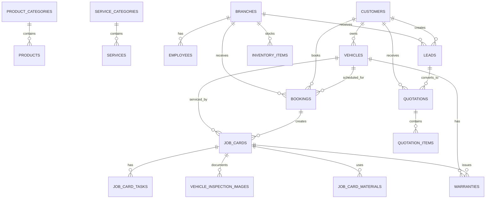

# Database Design

## Principles
- PostgreSQL.
- UUID primary keys.
- snake_case tables and columns.
- `created_at` and `updated_at` on main tables.
- `is_active` or `is_published` for public visibility.
- Pricing must come from database, never from AI.
- JSONB is allowed for flexible metadata, not core workflows.

## Entity Groups
Public/CMS:
- product_categories
- products
- service_categories
- services
- branches
- articles

CRM:
- customers
- vehicles
- leads

Booking/Sales:
- employees
- bookings
- quotations
- quotation_items

Garage Operations:
- job_cards
- job_card_tasks
- vehicle_inspection_images
- inventory_items
- job_card_materials
- warranties
- invoices
- invoice_items

AI/Audit:
- ai_interactions
- ai_image_analyses
- audit_logs

## ERD


## Enum Values

### price_label
- fixed
- from
- contact

### lead.status
- new
- contacted
- quoted
- booked
- lost

### booking.status
- pending
- confirmed
- checked_in
- in_progress
- completed
- cancelled
- no_show

### quotation.status
- draft
- sent
- accepted
- rejected
- expired

### job_card.status
- created
- inspection
- waiting_parts
- in_progress
- qc
- completed
- cancelled

## Required Indexes
```sql
CREATE UNIQUE INDEX ux_products_slug ON products(slug);
CREATE INDEX ix_products_category_id ON products(category_id);
CREATE INDEX ix_products_is_active ON products(is_active);
CREATE UNIQUE INDEX ux_services_slug ON services(slug);
CREATE INDEX ix_services_category_id ON services(category_id);
CREATE INDEX ix_services_is_active ON services(is_active);
CREATE UNIQUE INDEX ux_branches_slug ON branches(slug);
CREATE INDEX ix_branches_province ON branches(province);
CREATE INDEX ix_branches_is_active ON branches(is_active);
CREATE UNIQUE INDEX ux_articles_slug ON articles(slug);
CREATE INDEX ix_articles_is_published ON articles(is_published);
CREATE INDEX ix_articles_published_at ON articles(published_at DESC);
CREATE INDEX ix_leads_status ON leads(status);
CREATE INDEX ix_leads_branch_id ON leads(branch_id);
CREATE INDEX ix_leads_created_at ON leads(created_at DESC);
CREATE INDEX ix_bookings_branch_time ON bookings(branch_id, start_time, end_time);
CREATE INDEX ix_job_cards_status ON job_cards(status);
CREATE INDEX ix_inventory_branch_product ON inventory_items(branch_id, product_id);
```
